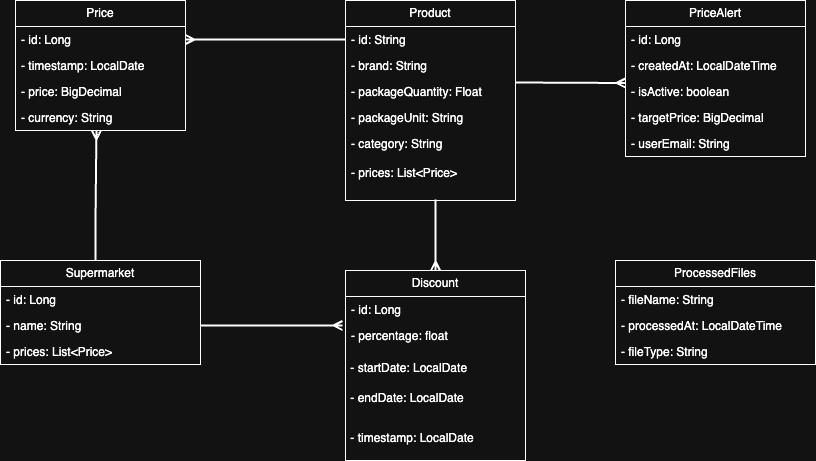

# price-comparator-market

**Price Comparator - Market** is a backend service for comparing grocery prices across major supermarket chains (e.g., Lidl, Kaufland, Profi).  
It allows users to:

- Compare product prices across stores
- Track price changes and discounts over time
- Find the best deals for their shopping list

The system is designed around core entities like **Product**, **Store**, **Price**, and **Discount**, making it easy to extend with new features.

---

## Class Diagram

The following diagram illustrates the main entities and relationships between them used in the project:

